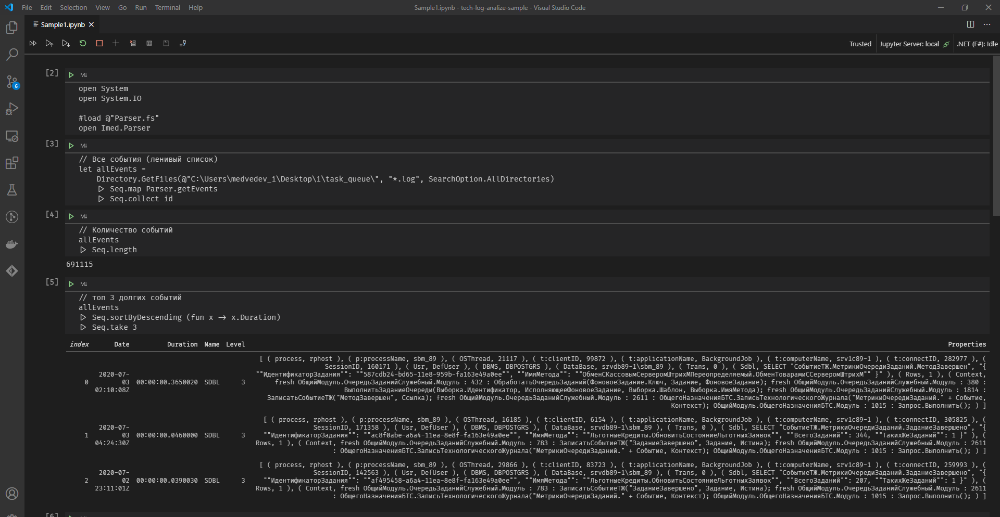
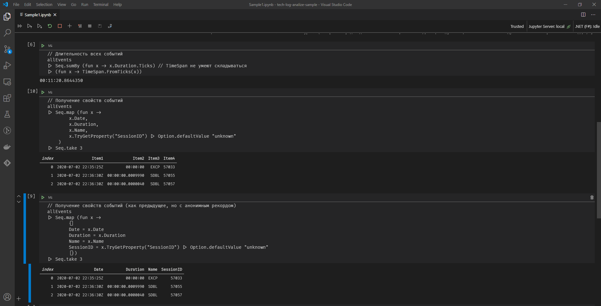
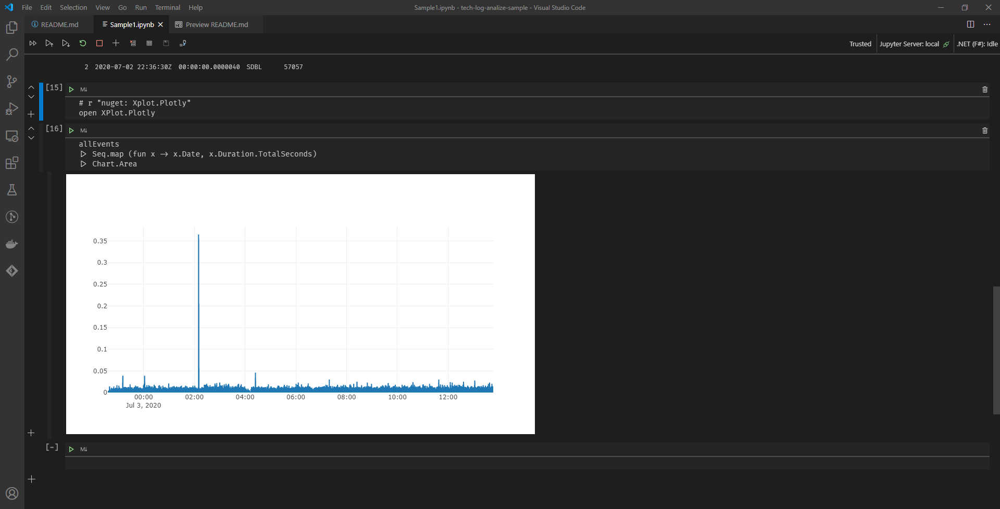

# tech-log-analize-sample

Пример анализа логов технологического журнала 1С

Описание файлов:
- Parser.fs - код парсера
- Program.fs - для использования в консоли
- Sample1.ipynb - пример как интерактивно анализировать в VSCode, дополнительно требуется установить [плагин](https://marketplace.visualstudio.com/items?itemName=ms-dotnettools.dotnet-interactive-vscode)

Скриншоты:

